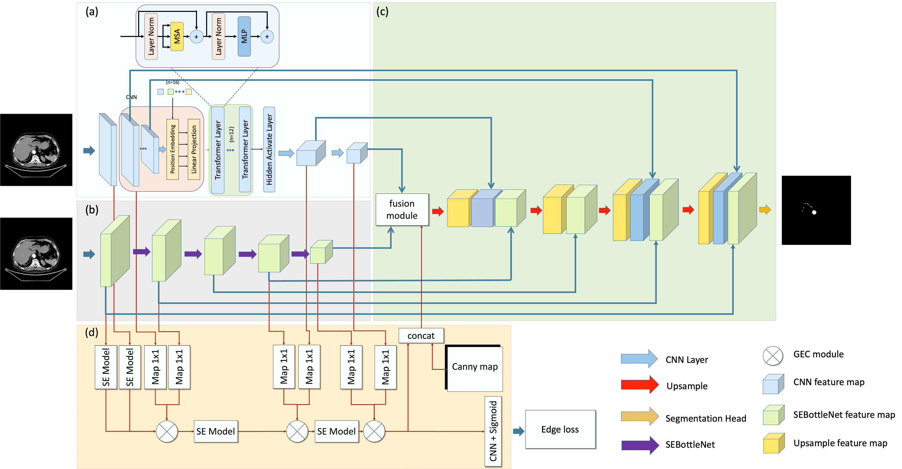

# TransFusionNet: Liver tumor and vessel segmentation

TransFusionNet: Semantic and Spatial Features Fusion Framework for Liver Tumor and Vessel Segmentation Under JetsonTX2



## Requirement

```
Package                Version
---------------------- ---------------
albumentations         0.5.2
imbalanced-learn       0.8.1
ml-collections         0.1.0
numpy                  1.20.3
opencv-python          4.5.4.58
pandas                 1.3.4
pynrrd                 0.4.2
scikit-image           0.18.3
scikit-learn           1.0.1
scipy                  1.7.2
seaborn                0.11.2
SimpleITK              2.1.1
torch                  1.8.0
tqdm                   4.62.3
vtk                    9.1.0
```

## Train module

```
python trainTFNet.py
```


## Citation

If you find this work useful for your research, please cite our paper

```
@ARTICLE{9893911,
  author={Wang, Xun and Zhang, Xudong and Wang, Gan and Zhang, Ying and Shi, Xin and Dai, Huanhuan and Liu, Min and Wang, Zixuan and Meng, Xiangyu},
  journal={IEEE Journal of Biomedical and Health Informatics}, 
  title={TransFusionNet: Semantic and Spatial Features Fusion Framework for Liver Tumor and Vessel Segmentation Under JetsonTX2}, 
  year={2022},
  volume={},
  number={},
  pages={1-12},
  doi={10.1109/JBHI.2022.3207233}}
```

